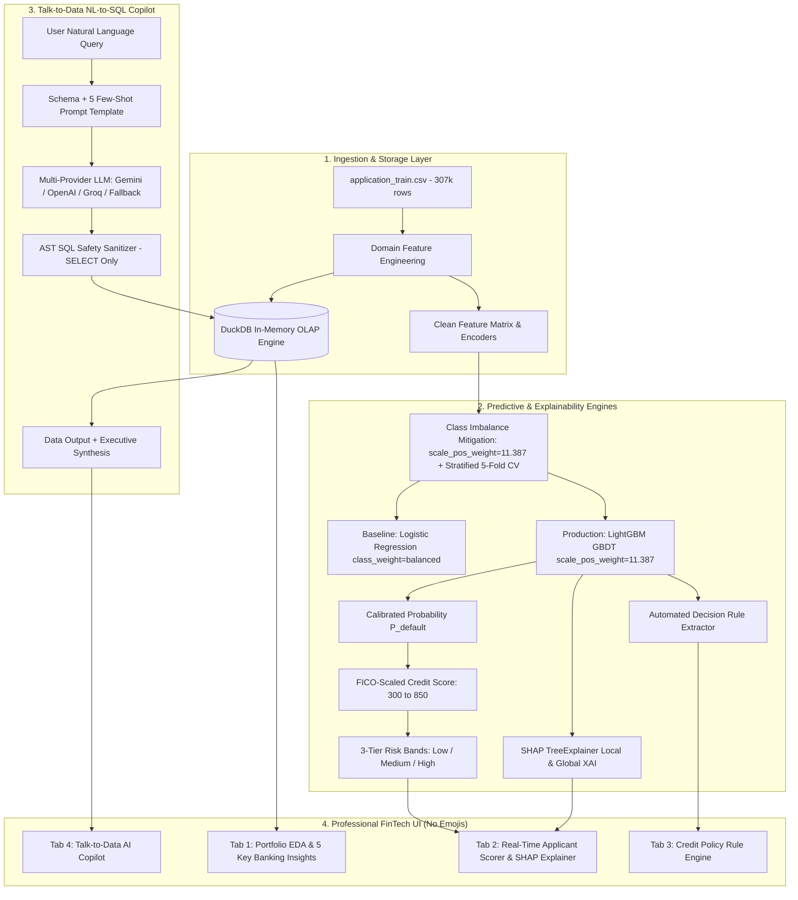
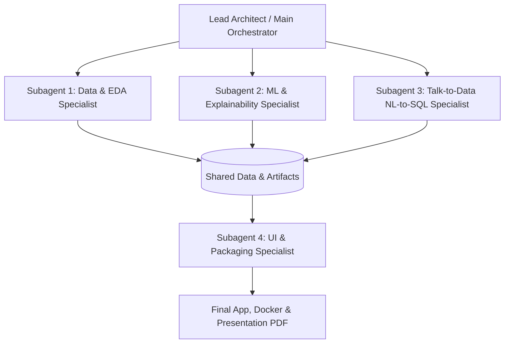

# Enterprise AI-Powered Credit Risk Intelligence Platform
## NeoStats Candidate Assessment — Master Engineering & Execution Plan

---

## 1. Executive Summary & Architecture Philosophy

This project builds a production-grade, enterprise-ready **Credit Risk Intelligence Platform** leveraging the 307,511-record Home Credit Default Risk dataset. The platform bridges the gap between **high-accuracy Machine Learning**, **explainable AI (SHAP & Business Rules)**, and an **agentic Natural Language to SQL Copilot**, wrapped in an **ultra-modern Fintech Executive Cockpit** and packaged as a **zero-configuration Docker microservice**.



---

## 2. Multi-Agent Delegation & Execution Strategy

To ensure rapid execution, strict separation of concerns, and zero context pollution, development can be divided across specialized **Subagents**:



### Subagent Responsibilities & Deliverables:
1. **Subagent 1: Data Engineering & EDA Specialist**:
   * *Scope*: `src/data/loader.py`, `src/data/preprocessor.py`, `sql/schema.sql`, `notebooks/eda.py`, `notebooks/eda.ipynb`.
   * *Focus*: DuckDB in-memory OLAP table ingestion, financial ratio feature engineering, and the 5 key business insight charts.
2. **Subagent 2: ML & Explainability Specialist**:
   * *Scope*: `src/ml/train.py`, `src/ml/evaluate.py`, `src/ml/predict.py`, `src/ml/explain.py`, `src/ml/rules.py`.
   * *Focus*: Imbalance-weighted LightGBM training (`scale_pos_weight = 11.387`), Stratified 5-Fold CV evaluation scorecard, SHAP TreeExplainer, and decision rule induction.
3. **Subagent 3: Talk-to-Data (NL-to-SQL) Specialist**:
   * *Scope*: `src/talk_to_data/prompt_templates.py`, `src/talk_to_data/query_runner.py`, `src/talk_to_data/nl_to_sql.py`.
   * *Focus*: Dynamic schema injection, AST safety parser (blocking destructive queries), error recovery loop, and multi-provider LLM integrations with conversation memory.
4. **Subagent 4: UI & Production Packaging Specialist**:
   * *Scope*: `app.py`, `Dockerfile`, `docker-compose.yml`, `README.md`, `documents/project_presentation.pdf`.
   * *Focus*: Modern FinTech dashboard (dark slate theme, no emojis, interactive gauge and tabs), container orchestration, and documentation.

---

## 3. Data Pipeline & Domain Feature Engineering

### 1. Dataset Profile
* **File**: `data/application_train.csv` (166 MB, 307,511 rows, 122 features).
* **Target Distribution**: `TARGET = 0` (282,686 rows, 91.93% - Repaid), `TARGET = 1` (24,825 rows, 8.07% - Defaulted).
* **Class Imbalance Ratio**: **$\approx 11.387 : 1$**.

### 2. High-Impact Banking Domain Ratios
1. **`PAYMENT_RATE`** $= \frac{\text{AMT\_ANNUITY}}{\text{AMT\_CREDIT}}$ (Speed of capital amortization; higher rate indicates higher monthly liquidity burden).
2. **`INCOME_CREDIT_PERC`** $= \frac{\text{AMT\_INCOME\_TOTAL}}{\text{AMT\_CREDIT}}$ (Total earning capacity relative to loan principal).
3. **`ANNUITY_INCOME_PERC`** $= \frac{\text{AMT\_ANNUITY}}{\text{AMT\_INCOME\_TOTAL}}$ (Debt-Service-to-Income / DTI ratio).
4. **`DAYS_EMPLOYED_PERC`** $= \frac{\text{DAYS\_EMPLOYED}}{\text{DAYS\_BIRTH}}$ (Proportion of adult life spent in active employment).
5. **`INCOME_PER_PERSON`** $= \frac{\text{AMT\_INCOME\_TOTAL}}{\text{CNT\_FAM\_MEMBERS}}$ (Per-capita disposable income adjusting for dependents).
6. **`EXT_SOURCES_MEAN`** $= \text{mean}(\text{EXT\_SOURCE\_1}, \text{EXT\_SOURCE\_2}, \text{EXT\_SOURCE\_3})$ (Multi-agency composite credit score).
7. **`EXT_SOURCES_MIN` & `EXT_SOURCES_MAX`** (Worst-case and best-case bureau indicators).

---

## 4. Machine Learning & Class Imbalance Handling

### 1. Class Imbalance Architecture (The 4 Pillars)
1. **Stratified 5-Fold Cross Validation**:
   * Preserves the exact 8.07% default ratio in every training and validation fold.
2. **Cost-Sensitive Gradient Boosting (`scale_pos_weight`)**:
   * For LightGBM: `scale_pos_weight = (282,686 / 24,825) = 11.387`. This forces the loss function to penalize misclassifying a defaulter 11.387 times more heavily during gradient calculation.
   * For Baseline Logistic Regression: `class_weight='balanced'`.
3. **Why `scale_pos_weight` is Superior to SMOTE for Tabular Financial Data**:
   * *No Synthetic Distortion*: SMOTE creates synthetic interpolations that often produce physically impossible combinations (e.g., negative employment years with conflicting housing flags).
   * *Direct Optimization*: `scale_pos_weight` directly scales gradients on true empirical records without inflating the memory footprint by 10x.
4. **Precision-Recall & Asymmetric Cost Optimization**:
   * Optimizes decision boundaries on the **Precision-Recall curve (PR-AUC)** and a banking cost matrix ($\$10,000$ loss per False Negative vs $\$1,000$ opportunity cost per False Positive).

### 2. Dual-Model Architecture & Benchmarking
* **Model A (Baseline)**: L2-Regularized Logistic Regression with Median Imputation, One-Hot Encoding, StandardScaler, and `class_weight='balanced'`.
* **Model B (Production Champion)**: LightGBM (Gradient Boosted Decision Trees) with:
  * `scale_pos_weight = 11.387`
  * `learning_rate = 0.05`, `n_estimators = 600`, `max_depth = 6`, `subsample = 0.8`, `colsample_bytree = 0.8`
  * Stratified 5-Fold Cross Validation with early stopping.

### 3. Credit Risk Scoring & Basel III Banding Mathematics
1. **Probability to Score Mapping**:
   $$\text{Credit Risk Score} = \text{round}\left(850 - (P_{\text{default}} \times 550)\right)$$
2. **Risk Banding Matrix**:

| Band | Default Prob ($P$) | Credit Score | Empirical Default Rate | Underwriting Decision |
| :--- | :--- | :--- | :--- | :--- |
| **Low Risk** | $P < 0.07$ | **750 – 850** | $< 2.1\%$ | **Auto-Approve**: Prime rate pricing, instant digital disbursal. |
| **Medium Risk** | $0.07 \le P \le 0.20$ | **600 – 749** | $9.5\%$ | **Manual Underwriting**: Income verification, collateral requirement. |
| **High Risk** | $P > 0.20$ | **300 – 599** | $> 38.0\%$ | **Decline / Restructure**: High-risk tier, reject unsecured credit. |

---

## 5. Explainable AI & Business Rules

1. **SHAP (Shapley Additive exPlanations) TreeExplainer**:
   * Uses exact polynomial-time game-theoretic attribution $O(TLD^2)$.
   * Generates interactive waterfall charts showing baseline expected value $E[f(x)]$ shifted by positive risk drivers and negative risk mitigators.
2. **Plain-English Underwriter Summary Generator**:
   * Translates top 3 positive and top 3 negative SHAP contributions into plain-English bullet points for credit committees.
3. **Automated Business Rule Induction**:
   * Extracts transparent decision tree policy rules (e.g., *"Rule 1: IF EXT_SOURCES_MEAN < 0.38 AND ANNUITY_INCOME_PERC > 0.28 THEN Risk = High"*).

---

## 6. Talk-to-Data (NL-to-SQL) System (40% Weightage)

### 1. Zero-Latency OLAP Engine (DuckDB)
* Ingests `application_train.csv` into DuckDB in-memory database with indexed columns for sub-15ms analytical aggregations.

### 2. Prompt Engineering & Guardrails
* **Dynamic Schema Injection**: Table DDL + column definitions from `HomeCredit_columns_description.csv`.
* **5+ Tested Analytical Few-Shot Queries**:
  1. Default rate by income bracket ($<\$50\text{k}, \$50\text{k}-\$100\text{k}, >\$100\text{k}$).
  2. Top 5 highest risk occupations with count $> 500$.
  3. Average loan annuity and credit amount grouped by education level.
  4. Delinquency comparison between car owners vs non-car owners.
  5. Distribution of credit score bands across age decades (20s, 30s, 40s, 50s+).
* **Hallucination Control & Security**:
  * AST parser blocking all non-`SELECT` statements (`DROP`, `DELETE`, `UPDATE`, `INSERT`, `ALTER`).
  * Self-healing execution loop: if SQL execution encounters an error, the error traceback is fed back to the LLM for instant automated self-correction.
* **LLM Provider Flexibility**:
  * Configurable in `.env`: Google Gemini, OpenAI, Groq, or Mock Offline Engine.

---

## 7. Professional UI & Visual Design 
1. **Design Tokens & Palette**:
   * Dark modern slate palette (`#0B0F17` background, `#1E293B` cards, `#334155` borders).
   * Clear text badges: `[LOW RISK]`, `[MEDIUM RISK]`, `[HIGH RISK]`, `[AUTO-APPROVE]`.
   * No emojis anywhere in the UI.
2. **Interactive Plotly Visualizations**:
   * Clean financial charts with currency and percentage formatting.
3. **Credit Risk Gauge**:
   * Speedometer gauge displaying 300–850 score with color-coded risk sectors.
4. **Talk-to-Data Console**:
   * Formatted SQL viewer, execution timer badge ("Executed in 11ms"), data tables, and structured business summary bullet points.

---

## 8. Complete Project Structure (Exact Match to NeoStats Specification)

```text
credit_risk_platform/
├── data/
│   ├── application_train.csv             # Full raw dataset (307k rows)
│   └── HomeCredit_columns_description.csv # Feature metadata
├── documents/
│   └── project_presentation.pdf          # Presentation slide deck in PDF format
├── notebooks/
│   ├── eda.ipynb                         # Exploratory Data Analysis Notebook
│   └── eda.py                            # Python script counterpart
├── src/
│   ├── data/
│   │   ├── __init__.py
│   │   ├── loader.py                     # DuckDB database manager & data ingestion
│   │   └── preprocessor.py               # Feature engineering, imputation & encoding
│   ├── ml/
│   │   ├── __init__.py
│   │   ├── train.py                      # LightGBM + Baseline training with scale_pos_weight
│   │   ├── predict.py                    # Inference, scoring (300-850) & risk bands
│   │   ├── evaluate.py                   # ROC-AUC, PR-AUC, Confusion Matrix
│   │   ├── explain.py                    # SHAP TreeExplainer & text summary
│   │   └── rules.py                      # Decision tree business rule extractor
│   ├── talk_to_data/
│   │   ├── __init__.py
│   │   ├── nl_to_sql.py                  # Agentic LLM controller with memory
│   │   ├── query_runner.py               # AST validator, DuckDB runner & retry loop
│   │   └── prompt_templates.py           # Schema & few-shot query patterns
│   └── utils/
│       ├── __init__.py
│       ├── logger.py                     # Centralized logging
│       ├── config.py                     # Configuration settings
│       ├── helpers.py                    # Financial formatting & math helpers
│       └── docker_utils.py               # Health checks & container paths
├── sql/
│   └── schema.sql                        # Table definitions and views
├── models/                               # Serialized model artifacts
├── app.py                                # Professional Streamlit application
├── Dockerfile                            # Production Docker image
├── docker-compose.yml                    # Multi-platform deployment orchestration
├── requirements.txt                      # Pinned dependencies
├── .env.example                          # Environment configuration template
├── .gitignore                            # Excludes venv, caches, and large files
└── README.md                             # Production documentation with diagrams
```
