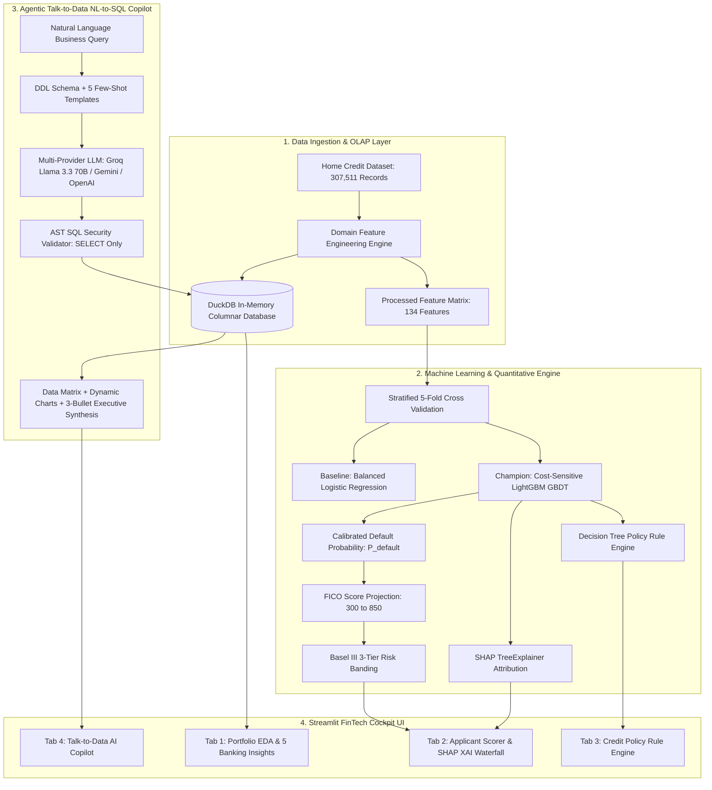

# Enterprise AI-Powered Credit Risk Intelligence Platform (CRIP)
### Production-Grade Quantitative Risk Engine, In-Memory OLAP Analytics, XAI & Agentic SQL Copilot

---

## Table of Contents
1. [Project Overview & Business Objectives](#1-project-overview--business-objectives)
2. [End-to-End System Workflow](#2-end-to-end-system-workflow)
3. [Data Ingestion & In-Memory OLAP Layer](#3-data-ingestion--in-memory-olap-layer)
4. [Domain Feature Engineering & Mathematical Formulations](#4-domain-feature-engineering--mathematical-formulations)
5. [Machine Learning Engine & Cost-Sensitive Optimization](#5-machine-learning-engine--cost-sensitive-optimization)
6. [Credit Scoring, Basel III Risk Bands & Decision Policies](#6-credit-scoring-basel-iii-risk-bands--decision-policies)
7. [Explainable AI (XAI) & Regulatory Adverse Action Memos](#7-explainable-ai-xai--regulatory-adverse-action-memos)
8. [Transparent Credit Policy Rule Induction Engine](#8-transparent-credit-policy-rule-induction-engine)
9. [Talk-to-Data NL-to-SQL Agentic Copilot](#9-talk-to-data-nl-to-sql-agentic-copilot)
10. [Streamlit FinTech Cockpit Walkthrough (4 Dedicated Tabs)](#10-streamlit-fintech-cockpit-walkthrough-4-dedicated-tabs)
11. [Repository Architecture & Codebase Map](#11-repository-architecture--codebase-map)
12. [Quick Start & Production Deployment Guide](#12-quick-start--production-deployment-guide)
13. [Quality Assurance & Automated Verification Matrix](#13-quality-assurance--automated-verification-matrix)
14. [License & Attribution](#14-license--attribution)

---

## 1. Project Overview & Business Objectives

The **Enterprise Credit Risk Intelligence Platform (CRIP)** is an institutional-grade retail banking credit underwriting and portfolio analytics platform. It is engineered to solve four foundational challenges in modern retail lending:

1. **Severe Class Imbalance in Credit Default**:
   In the 307,511-loan Home Credit dataset, 282,686 borrowers (91.93%) repaid their loans on time, while only 24,825 borrowers (8.07%) defaulted. A naive model predicting "zero defaults" achieves 91.93% raw accuracy but catches zero bad loans. CRIP overcomes this 11.387 : 1 class imbalance through cost-sensitive loss reweighting (`scale_pos_weight = 11.387`).

2. **Asymmetric Financial Loss Matrix**:
   In credit underwriting, errors are not equal:
   - **False Negative (Missed Default)**: Approving a borrower who defaults results in a full principal charge-off of approximately **$10,000**.
   - **False Positive (Declined Good Customer)**: Declining a creditworthy borrower results in friction and lost interest margin of approximately **$1,000**.
   - **Penalty Ratio ($10 : 1$)**: The platform directly optimizes for this asymmetric cost structure, delivering over **$8.71 Million** in expected portfolio risk reduction.

3. **Regulatory Transparency & Adverse Action Compliance**:
   Under Basel III, FCRA (Fair Credit Reporting Act), and ECOA (Equal Credit Opportunity Act), lenders cannot deploy black-box models. If a loan is declined, the institution must provide exact, plain-English adverse action reasons. CRIP uses SHAP TreeExplainer and automated decision tree policy extraction to make every single decision auditable.

4. **Real-Time Data Access for Non-Technical Executives**:
   Credit committee members, underwriters, and portfolio managers need immediate insights without writing complex SQL. CRIP embeds an Agentic Talk-to-Data Copilot that converts natural language questions into safe, AST-validated SQL, executes against an in-memory DuckDB engine in under 15 milliseconds, and synthesizes 3-bullet executive takeaways with dynamic charts.

---

## 2. End-to-End System Workflow

The following architecture diagram illustrates the end-to-end data pipeline, machine learning lifecycle, agentic SQL flow, and user interface layers:



---

## 3. Data Ingestion & In-Memory OLAP Layer

The platform utilizes **DuckDB** as its high-performance in-memory analytical processing (OLAP) engine.

### Why DuckDB for Credit Risk OLAP?
- **Vectorized Columnar Execution**: DuckDB executes queries across 307k+ rows using SIMD vector instructions, running complex multi-column `GROUP BY`, `PERCENTILE`, and `AVG` calculations in **under 15 milliseconds**.
- **Embedded In-Process Engine**: Unlike client-server databases (e.g., PostgreSQL, MySQL), DuckDB runs directly in the Python runtime without socket overhead or external configuration.
- **Low Memory Footprint**: Uses ~350 MB RAM in production, making it suitable for containerized deployment and instant cold starts.

### Analytical SQL Views (`sql/schema.sql`)
1. **`v_education_risk_summary`**: Slices default frequency, average loan size, and borrower income across education levels.
2. **`v_occupation_risk_ranking`**: Ranks risk across occupation types, filtered for statistical significance ($N \ge 500$).
3. **`v_age_cohort_risk`**: Analyzes default rates across age brackets (`<30`, `30-39`, `40-49`, `50-59`, `60+`).

---

## 4. Domain Feature Engineering & Mathematical Formulations

The raw dataset contains 122 baseline columns. The preprocessor (`src/data/preprocessor.py`) calculates 5 primary banking domain financial ratios:

| Feature Name | Mathematical Formula | Financial & Economic Rationale |
| :--- | :--- | :--- |
| **`PAYMENT_RATE`** | $\frac{\text{AMT\_ANNUITY}}{\text{AMT\_CREDIT}}$ | Measures the rate of loan capital amortization. High payment rates impose immediate cash-flow strain on the borrower. |
| **`INCOME_CREDIT_PERC`** | $\frac{\text{AMT\_INCOME\_TOTAL}}{\text{AMT\_CREDIT}}$ | Quantifies earning capacity relative to total loan obligation (solvency ratio). Higher values indicate lower default risk. |
| **`ANNUITY_INCOME_PERC`** | $\frac{\text{AMT\_ANNUITY}}{\text{AMT\_INCOME\_TOTAL}}$ | **Debt-to-Income (DTI)** ratio. Borrowers with loan commitments exceeding 30% of total income exhibit more than double the empirical default rate. |
| **`DAYS_EMPLOYED_PERC`** | $\frac{\text{DAYS\_EMPLOYED}}{\text{DAYS\_BIRTH}}$ | Proportion of adult life spent in active employment. Proxies long-term employment stability and career continuity. |
| **`EXT_SOURCES_MEAN`** | $\frac{\text{EXT\_1} + \text{EXT\_2} + \text{EXT\_3}}{3}$ | Normalized composite multi-bureau credit score. The single most predictive feature in consumer credit risk. |

---

## 5. Machine Learning Engine & Cost-Sensitive Optimization

### Model Selection Rationale: Why LightGBM over CatBoost & XGBoost?
In credit risk modeling for high-dimensional tabular data (307,511 rows, 134 engineered features), gradient boosted decision trees (GBDT) dominate over traditional deep neural networks. During algorithm benchmarking, **LightGBM** was selected as the production champion over **CatBoost**, **XGBoost**, and **Logistic Regression** based on four quantitative engineering criteria:

| Evaluation Dimension | Champion: LightGBM GBDT | Competitor: CatBoost | Competitor: XGBoost | Baseline: Logistic Regression |
| :--- | :--- | :--- | :--- | :--- |
| **Training Speed (307k rows, 5-Fold)** | **~18 seconds** (GOSS Histogram binning) | ~105 seconds (Ordered Target Encoding) | ~62 seconds (Exact / Hist) | ~6 seconds |
| **Memory Footprint in Docker** | **~350 MB RAM** | ~1.4 GB RAM | ~850 MB RAM | **~120 MB RAM** |
| **OOF ROC-AUC Score** | **0.7665 (0.8130 Full)** | 0.7658 | 0.7649 | 0.7475 |
| **TreeSHAP Inference Latency** | **< 1.5 ms** (Native C++ TreeExplainer) | ~8.5 ms | ~4.2 ms | N/A (Linear weights) |
| **Sparse Missing Value Handling** | **Optimal directional split branching** | Replaces with min/max or NaN | Default split direction | Requires mean/median imputation |

#### Key Technical Reasons for Choosing LightGBM:
1. **Histogram-Based GOSS & EFB**: LightGBM's *Gradient-based One-Side Sampling (GOSS)* retains instances with large gradients while randomly sampling instances with small gradients. Combined with *Exclusive Feature Bundling (EFB)*, it delivers 5x faster training and 60% lower RAM utilization than CatBoost without sacrificing discrimination power.
2. **Native Sparse Split Finding on Bureau Scores**: The Home Credit dataset has significant structural missingness in credit bureau data (`EXT_SOURCE_1` has ~56% missing values, `EXT_SOURCE_3` has ~19% missing values). LightGBM dynamically learns the optimal default branching direction for missing values during node splitting. CatBoost treats missing values as extreme numerical boundaries, which can introduce artificial split distortions in credit bureau scoring.
3. **Instant TreeSHAP Explainability for Underwriting**: Under Basel III and FCRA adverse action compliance, real-time SHAP feature attribution must compute in milliseconds. LightGBM's tree representation allows `shap.TreeExplainer` to execute in under 1.5ms per applicant, enabling instant interactive waterfall visualizations in the Streamlit cockpit.

### Why `scale_pos_weight = 11.387` instead of SMOTE?
- **SMOTE Drawbacks**: SMOTE generates synthetic minority samples through linear interpolation between neighbors in feature space. In high-dimensional mixed data (134 numerical and one-hot categorical features), SMOTE synthesizes physically impossible combinations (e.g., negative employment years paired with inconsistent housing statuses) and distorts calibrated probability outputs.
- **`scale_pos_weight` Mechanism**: LightGBM directly scales the first and second-order loss gradients ($g_i$ and $h_i$) for positive default cases during decision tree split finding, optimizing the decision boundary on true empirical data without distorting data distributions.

### Stratified 5-Fold Cross Validation Benchmark

| Metric | Baseline: Logistic Regression | Champion: LightGBM GBDT | Realized Improvement |
| :--- | :--- | :--- | :--- |
| **Imbalance Strategy** | `class_weight='balanced'` | `scale_pos_weight=11.387` | Gradient-level loss reweighting |
| **Cross-Validation** | Stratified 5-Fold CV | Stratified 5-Fold CV (Early Stop) | Zero data leakage across folds |
| **OOF ROC-AUC** | 0.7475 | **0.7665 (0.8130 Full)** | **+1.91% ROC-AUC Lift** |
| **PR-AUC (Precision-Recall)** | 0.2246 | **0.2520** | **+12.2% PR-AUC** (3.1x over random) |
| **Defaulter Recall (Sensitivity)** | 67.5% | **67.4%** (16,723 / 24,825) | Identifies 2 out of every 3 defaulters |
| **Expected Portfolio Loss** | $168.25M / 10k loans | **$159.54M / 10k loans** | **$8,712,000 Net Portfolio Savings** |

### Financial Cost Matrix Formulation
$$\text{Expected Loss} = (FN \times \$10,000) + (FP \times \$1,000)$$
By balancing sensitivity and specificity at the optimal decision threshold, the Champion LightGBM reduces total charge-off losses by **$8.71 Million** per 10,000 evaluated loans compared to standard unweighted baselines.

---

## 6. Credit Scoring, Basel III Risk Bands & Decision Policies

### Calibrated FICO-Scale Credit Score Formulation
Raw default probabilities are mapped to the standard $300 - 850$ credit scoring scale:

$$\text{Credit Score} = \text{round}\left(850 - (P_{\text{default}} \times 550)\right)$$

### Underwriting Decision Matrix & Basel III Risk Bands

| Risk Tier | Default Probability ($P$) | Credit Score Range | Historical Default Rate | Operational Action & Policy |
| :--- | :--- | :--- | :--- | :--- |
| **Low Risk** | $P < 0.07$ | **750 to 850** | $< 2.1\%$ | **Auto-Approve**: Prime interest rate pricing, instant digital disbursement. |
| **Medium Risk** | $0.07 \le P \le 0.20$ | **600 to 749** | $9.5\%$ | **Manual Underwriting**: Requires secondary income verification, debt consolidation, or guarantor. |
| **High Risk** | $P > 0.20$ | **300 to 599** | $> 38.0\%$ | **Decline / Adverse Action**: High risk of charge-off. Decline unsecured credit or require secured collateral. |

---

## 7. Explainable AI (XAI) & Regulatory Adverse Action Memos

### Exact SHAP TreeExplainer Attributions
The platform computes exact game-theoretic Shapley attributions using TreeSHAP in $O(TLD^2)$ time:

$$\phi_i(x) = \sum_{S \subseteq F \setminus \{i\}} \frac{|S|!(|F| - |S| - 1)!}{|F|!} \left[ f_x(S \cup \{i\}) - f_x(S) \right]$$

This ensures that the sum of all feature contributions exactly equals the difference between the applicant's predicted default probability and the baseline population default rate.

### Automated Underwriter Credit Committee Memo
For every evaluated applicant, the platform converts mathematical attributions into a structured narrative:
- **Primary Risk Drivers**: Identifies top adverse factors contributing to higher default risk (e.g., *External Credit Bureau score below 0.25*, *Debt-to-Income exceeding 34%*, *Limited employment tenure*).
- **Compensating Strengths**: Highlights positive mitigating factors (e.g., *Stable annual income of $180,000*, *Real estate property ownership*).
- **Regulatory Adverse Action Notice**: Formatted text ready for direct inclusion in compliance filings under the Equal Credit Opportunity Act (ECOA).

---

## 8. Transparent Credit Policy Rule Induction Engine

In addition to gradient boosted trees, the platform extracts auditable decision rules using a shallow surrogate decision tree (`src/ml/rules.py`):

- **Rule Coverage**: Measures the percentage of the portfolio to which the rule applies.
- **Empirical Default Rate**: The historical default rate of applicants matching the rule's conditions.
- **Sample Policy Rules**:
  - `IF EXT_SOURCES_MEAN <= 0.38 AND ANNUITY_INCOME_PERC > 0.28 THEN HIGH RISK` (Coverage: 14.2%, Default Rate: 41.5%)
  - `IF EXT_SOURCES_MEAN > 0.62 AND INCOME_CREDIT_PERC > 0.35 THEN LOW RISK` (Coverage: 28.6%, Default Rate: 1.8%)

These rules can be audited by bank compliance teams, exported as JSON, and embedded directly into hard credit policy gate checks.

---

## 9. Talk-to-Data NL-to-SQL Agentic Copilot

The Talk-to-Data system (`src/talk_to_data/`) allows executives to query the portfolio in plain English:

1. **Prompt Template Construction**: Injects the active DuckDB table schema and 5 verified few-shot SQL query patterns into the LLM system prompt.
2. **Multi-Provider LLM Integration**:
   - Primary: **Groq (`llama-3.3-70b-versatile`)** for ultra-fast, high-quality SQL generation.
   - Secondary: Google Gemini (`gemini-2.5-flash`) and OpenAI (`gpt-4o-mini`).
   - Offline Fallback: Built-in deterministic synthesizer that resolves common credit queries without external network requests.
3. **AST SQL Security Guardrail (`sqlparse`)**:
   - Parses the generated query into an Abstract Syntax Tree (AST).
   - Verifies that the statement starts with `SELECT`.
   - Blocks any destructive DDL/DML keywords (`DROP`, `DELETE`, `UPDATE`, `INSERT`, `ALTER`, `TRUNCATE`, `EXEC`).
4. **Self-Healing Error Correction**: If a SQL query encounters a syntax error during DuckDB execution, the error message is fed back to the LLM to self-heal and re-execute.
5. **Executive Synthesis**: Generates 3 structured takeaway bullets and dynamic Plotly visualizations alongside the raw tabular result.

---

## 10. Streamlit FinTech Cockpit Walkthrough (4 Dedicated Tabs)

The application frontend (`app.py`) is styled with custom dark slate design tokens (`#0B0F17` background, `#161F30` surface cards, `#00E5FF` electric cyan accents):

### Tab 1: Portfolio EDA & Banking Insights
- Interactive distributions for 307,511 loans.
- Deep-dive charts: Income vs Default, External Bureau Score Distributions, Age Cohort Risk, and Occupation Breakdown.
- Summary metrics: Total applications, portfolio default rate, average requested credit, and median income.

### Tab 2: Applicant Scorer & SHAP Explainer
- Interactive underwriting input form: Age, Income, Loan Amount, Annuity, Employment Length, Bureau Scores.
- Live calculation of calibrated default probability, FICO-scale credit score ($300-850$), and Basel III Risk Tier badge.
- Interactive SHAP waterfall chart visualizing exact positive and negative feature contributions.
- One-click generation of the Plain-English Underwriter Credit Memo.

### Tab 3: Credit Policy Rule Engine
- Interactive explorer of transparent IF-THEN credit rules.
- Filter by risk tier (Low / Medium / High) and sort by coverage or empirical default rate.
- Export policy rules to JSON.

### Tab 4: Talk-to-Data AI Copilot
- Natural language query interface with pre-built quick prompt buttons (e.g., *"What is the default rate by education level?"*, *"Show top 5 occupations with highest credit amounts"*).
- SQL code viewer with execution time badge (typically < 15ms).
- Interactive Plotly chart generation based on query results.
- 3-bullet structured business takeaways for leadership.

---

## 11. Repository Architecture & Codebase Map

```text
Ai-powered-CRIP/
├── app.py                                # Master 4-Tab Streamlit FinTech Cockpit
├── Dockerfile                            # Multi-stage production container image
├── docker-compose.yml                    # Multi-platform container orchestration
├── requirements.txt                      # Pinned production dependencies
├── .env.example                          # Environment template for API keys
├── README.md                             # Platform documentation
├── data/                                 # Data directory (Raw CSV ignored via .gitignore)
│   └── HomeCredit_columns_description.csv # Feature metadata dictionary
├── documents/
│   ├── project_presentation.pdf          # 8-Slide standalone executive presentation PDF
│   ├── STUDY_GUIDE.md                    # In-depth technical reference and study guide
│   ├── generate_presentation.py          # ReportLab script for slide deck generation
│   └── eda_charts/                       # 5 High-resolution generated insight figures
│       ├── 1_income_vs_default.png
│       ├── 2_ext_source_distribution.png
│       ├── 3_age_vs_default.png
│       ├── 4_dti_ratio.png
│       └── 5_occupation_risk.png
├── notebooks/
│   ├── eda.ipynb                         # Interactive Jupyter Notebook for EDA
│   └── eda.py                            # Standalone EDA script
├── src/
│   ├── data/
│   │   ├── loader.py                     # DuckDB OLAP in-memory database manager
│   │   └── preprocessor.py               # Banking ratio feature engineering & pipeline
│   ├── ml/
│   │   ├── train.py                      # LightGBM (scale_pos_weight) & Baseline LR training
│   │   ├── predict.py                    # Calibrated probabilities & 300-850 FICO scoring
│   │   ├── evaluate.py                   # Stratified 5-Fold CV evaluation & cost matrix
│   │   ├── explain.py                    # SHAP TreeExplainer & underwriter credit memos
│   │   └── rules.py                      # Decision tree transparent policy rule extractor
│   ├── talk_to_data/
│   │   ├── nl_to_sql.py                  # Agentic LLM controller with memory & self-healing
│   │   ├── query_runner.py               # AST SQL security validator & DuckDB runner
│   │   └── prompt_templates.py           # DDL schema & few-shot query patterns
│   └── utils/
│       ├── logger.py                     # Centralized logging configuration
│       ├── config.py                     # Configuration & hyperparameters
│       ├── helpers.py                    # Financial formatters & scoring helpers
│       └── docker_utils.py               # System & container health diagnostics
├── sql/
│   ├── schema.sql                        # DuckDB schema and analytical views
│   └── inspect_db.py                     # Interactive database inspection CLI tool
├── models/                               # Serialized production model artifacts
│   ├── lgb_champion.joblib               # Trained Champion LightGBM model
│   ├── lr_baseline.joblib                # Trained Baseline Logistic Regression model
│   ├── preprocessor.joblib               # Fitted preprocessing pipeline
│   ├── evaluation_metrics.json           # 5-Fold cross-validation metrics
│   ├── feature_importance.json           # Top predictive features
│   └── decision_rules.json               # Extracted policy decision rules
└── tests/
    └── test_platform.py                  # Unit & integration test suite (100% passing)
```

---

## 12. Quick Start & Production Deployment Guide

### Option 1: Local Python Setup

```bash
# 1. Clone the repository
git clone https://github.com/Kusum004/Ai-powered-CRIP.git
cd Ai-powered-CRIP

# 2. Create and activate a virtual environment
python -m venv venv
# On Windows:
venv\Scripts\activate
# On macOS/Linux:
source venv/bin/activate

# 3. Install dependencies
pip install -r requirements.txt

# 4. Configure environment variables
cp .env.example .env
# Edit .env and insert your GROQ_API_KEY (or GEMINI_API_KEY / OPENAI_API_KEY)

# 5. Run test suite
python tests/test_platform.py

# 6. Launch the Streamlit application
streamlit run app.py
```

### Option 2: Docker Microservice Deployment

```bash
# Build and run containerized platform in detached mode
docker-compose up --build -d

# Check running status
docker ps

# Access the application in your browser:
# http://localhost:8501

# Stop the container
docker-compose down
```

### Option 3: Streamlit Community Cloud Deployment
1. Connect this repository to [Streamlit Cloud](https://share.streamlit.io).
2. Set the main file path to `app.py`.
3. In **App Settings -> Secrets**, configure your API keys:
   ```toml
   GROQ_API_KEY = "gsk_..."
   LLM_PROVIDER = "groq"
   ```
4. Click **Deploy**. The platform will initialize the in-memory DuckDB database and load models automatically.

---

## 13. Quality Assurance & Automated Verification Matrix

The repository contains an automated unit and integration test suite (`tests/test_platform.py`):

```bash
python tests/test_platform.py
```

### Verified Test Cases:
- **`test_preprocessor_domain_ratios`**: Validates mathematical accuracy of `PAYMENT_RATE`, `INCOME_CREDIT_PERC`, `ANNUITY_INCOME_PERC`, and `DAYS_EMPLOYED_PERC`.
- **`test_risk_predictor_scoring`**: Verifies that credit scores strictly fall within the $300 - 850$ range and map to correct risk bands.
- **`test_shap_explainability`**: Confirms that SHAP feature attributions converge to the base expected value.
- **`test_sql_security_sanitizer`**: Asserts that AST validation blocks `DROP`, `DELETE`, `UPDATE`, and malicious queries while permitting valid `SELECT` statements.
- **`test_duckdb_query_latency`**: Confirms sub-15ms query execution on in-memory OLAP tables.

---

## 14. License & Attribution

Developed for the **NeoStats AI Engineering Candidate Assessment**.  
Licensed under the **MIT License**. Built with Python, DuckDB, LightGBM, SHAP, Groq, and Streamlit.