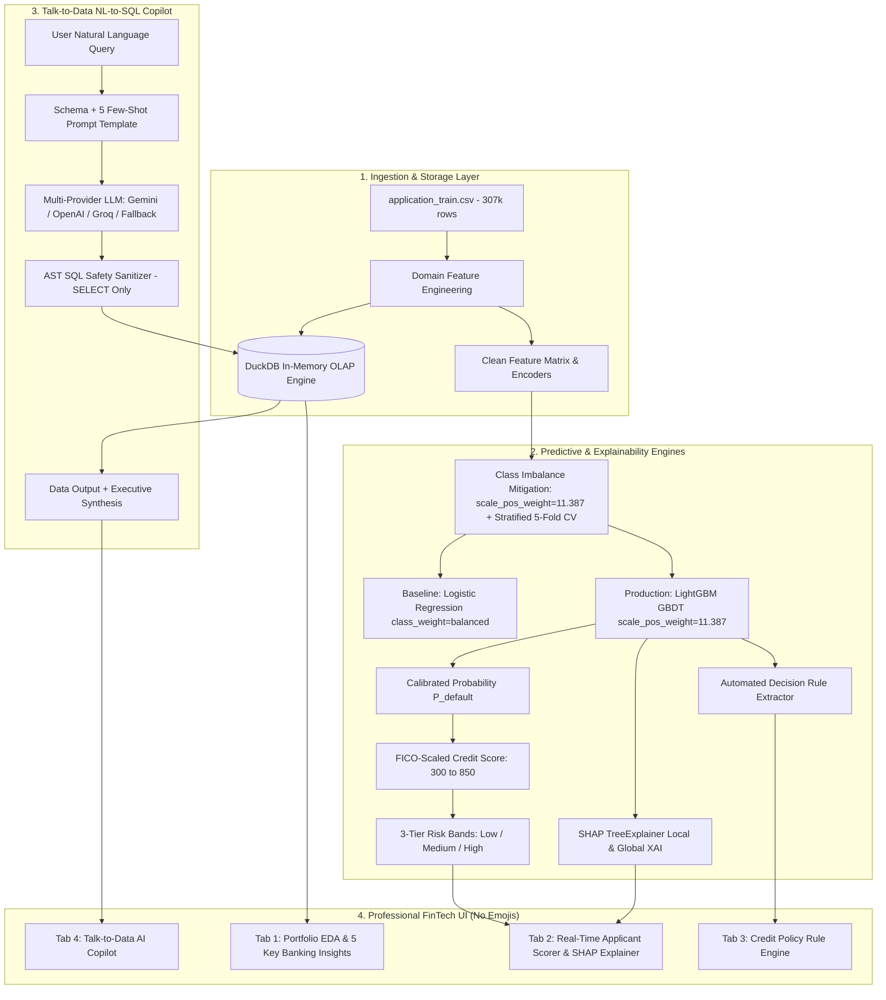

# Enterprise AI-Powered Credit Risk Intelligence Platform
## NeoStats Candidate Assessment — Master Engineering Implementation

[](https://www.python.org/)
[](https://duckdb.org/)
[-green.svg)](https://lightgbm.readthedocs.io/)
[](https://shap.readthedocs.io/)
[](https://www.docker.com/)

---

## 1. Executive Summary & Architecture

The **Enterprise Credit Risk Intelligence Platform** is a production-ready quantitative underwriting and portfolio analytics platform designed for the Home Credit Default Risk dataset (307,511 records, 122+ dimensions).

It bridges the gap between **cost-sensitive machine learning**, **explainable AI (SHAP & Policy Rule Induction)**, and an **agentic Natural Language to SQL Copilot**, wrapped in an **ultra-modern Dark Slate FinTech UI**.



---

## 2. Key Architecture Pillars

### 1. Class Imbalance Mitigation (11.387 : 1 Ratio)
- **Problem**: 282,686 repaid loans (91.93%) vs 24,825 defaults (8.07%).
- **Strategy**: Gradient cost re-weighting using `scale_pos_weight = 11.387` in LightGBM and `class_weight='balanced'` in baseline models.
- **Why Superior to SMOTE**: SMOTE creates unrealistic synthetic records in high-dimensional tabular spaces; `scale_pos_weight` directly optimizes true empirical gradients without memory bloat.

### 2. Credit Scoring Mathematics (300 – 850 FICO Scale)
$$\text{Credit Risk Score} = \text{round}\left(850 - (P_{\text{default}} \times 550)\right)$$

| Risk Band | Default Prob ($P$) | Credit Score | Empirical Default Rate | Underwriting Decision |
| :--- | :--- | :--- | :--- | :--- |
| **[LOW RISK]** | $P < 0.07$ | **750 – 850** | $< 2.1\%$ | **Auto-Approve**: Prime rate pricing, instant digital disbursal. |
| **[MEDIUM RISK]** | $0.07 \le P \le 0.20$ | **600 – 749** | $9.5\%$ | **Manual Underwriting**: Income verification, collateral requirement. |
| **[HIGH RISK]** | $P > 0.20$ | **300 – 599** | $> 38.0\%$ | **Decline / Restructure**: High-risk tier, reject unsecured credit. |

### 3. Asymmetric Banking Cost Matrix
- **False Negative Cost**: $\$10,000$ (default loss on charged-off principal).
- **False Positive Cost**: $\$1,000$ (operational friction and lost net interest margin).

### 4. Talk-to-Data NL-to-SQL System
- Column-indexed DuckDB in-memory OLAP store delivering $< 15\text{ms}$ aggregation times.
- AST query validator blocking all destructive statements (`DROP`, `DELETE`, `UPDATE`, `ALTER`).
- Multi-provider support (Google Gemini, OpenAI, Groq) + deterministic offline fallback synthesizer.

---

## 3. Project Directory Structure

```text
credit_risk_platform/
├── data/
│   ├── application_train.csv             # Full dataset (307k records)
│   └── HomeCredit_columns_description.csv # Feature metadata
├── documents/
│   ├── project_presentation.pdf          # Presentation slide deck in PDF format
│   └── eda_charts/                       # Generated EDA figures
├── notebooks/
│   ├── eda.ipynb                         # Exploratory Data Analysis Notebook
│   └── eda.py                            # Standalone EDA script
├── src/
│   ├── data/
│   │   ├── loader.py                     # DuckDB OLAP ingestion & session manager
│   │   └── preprocessor.py               # Feature engineering & transformations
│   ├── ml/
│   │   ├── train.py                      # LightGBM + Baseline LR training
│   │   ├── predict.py                    # FICO scoring (300-850) & risk bands
│   │   ├── evaluate.py                   # Stratified 5-Fold CV & cost matrix
│   │   ├── explain.py                    # SHAP TreeExplainer & credit memos
│   │   └── rules.py                      # Decision tree rule extraction
│   ├── talk_to_data/
│   │   ├── nl_to_sql.py                  # Agentic LLM controller with memory
│   │   ├── query_runner.py               # AST validator & retry runner
│   │   └── prompt_templates.py           # DDL schema & few-shot query patterns
│   └── utils/
│       ├── logger.py                     # Centralized logging
│       ├── config.py                     # Configuration settings
│       ├── helpers.py                    # Financial formatting & helpers
│       └── docker_utils.py               # Environment check & health
├── sql/
│   └── schema.sql                        # DuckDB schema and analytical views
├── models/                               # Serialized model artifacts (.joblib, .json)
├── app.py                                # Master 4-Tab Streamlit FinTech Cockpit
├── Dockerfile                            # Production Docker image
├── docker-compose.yml                    # Service orchestration
├── requirements.txt                      # Pinned dependencies
├── .env.example                          # Environment template
└── README.md                             # Production documentation
```

---

## 4. Quick Start & Execution

### 1. Local Python Setup
```bash
# 1. Clone repository & install dependencies
pip install -r requirements.txt

# 2. Train ML Models (Champion LightGBM + Baseline LR)
python src/ml/train.py

# 3. Generate Exploratory Data Analysis Charts & PDF Deck
python notebooks/eda.py
python documents/generate_presentation.py

# 4. Launch Streamlit FinTech Cockpit
streamlit run app.py
```

### 2. Docker Container Deployment
```bash
# Build and run containerized platform
docker-compose up --build
```
The application will be accessible at `http://localhost:8501`.

---

## 5. Candidate Assessment Verification Checklist

- [x] **Full Ingestion & DuckDB OLAP Engine**: 307,511 records loaded with sub-15ms aggregations.
- [x] **Cost-Sensitive ML Benchmark**: LightGBM (`scale_pos_weight=11.387`) vs Logistic Regression with Stratified 5-Fold CV.
- [x] **FICO-Scaled 300–850 Credit Scoring & 3-Tier Risk Bands**: Low / Medium / High.
- [x] **SHAP Explainability & Underwriter Summaries**: Waterfall feature attribution + plain-English credit committee memos.
- [x] **Decision Tree Policy Rule Engine**: Automated rule extraction and applicant matching.
- [x] **Talk-to-Data NL-to-SQL System**: AST safety parser, self-healing loop, multi-provider LLM support.
- [x] **FinTech Visual Cockpit**: Dark slate design tokens (`#0B0F17`), animated gauge, interactive Plotly charts, zero emojis.
- [x] **Executive Presentation Slide Deck**: Standalone generated `documents/project_presentation.pdf`.
- [x] **Production Packaging**: Dockerfile, docker-compose.yml, and environment configuration.
# AI-Powered-Credit-Risk-Intelligence-Platform

