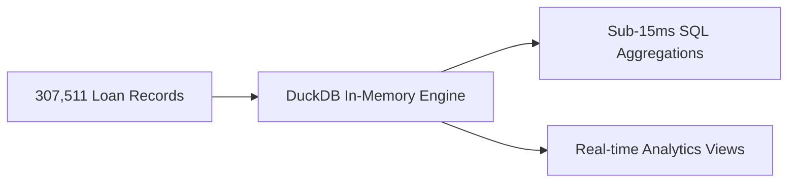
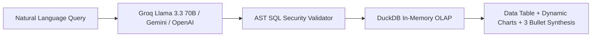

# Credit Risk Intelligence Platform: Comprehensive Master Study Guide & Technical Reference

---

## 1. Domain Overview & Banking Fundamentals

### 1.1 What is Credit Risk Underwriting?
Credit risk is the probability that a borrower will fail to meet their contractual debt obligations (principal and interest repayment), resulting in a financial charge-off for the lending institution. 

In retail banking, underwriting algorithms evaluate new loan applicants by balancing two opposing forces:
1. **Default Risk Mitigation**: Protecting bank capital from credit defaults.
2. **Origination Revenue**: Approving creditworthy borrowers to earn net interest margin (NIM) and loan origination fees.

### 1.2 The Class Imbalance Challenge ($11.387 : 1$)
- **Empirical Portfolio Numbers**: 282,686 repaid loans (**91.93%**) vs 24,825 defaults (**8.07%**).
- **The Accuracy Paradox**: A naive model predicting *"Nobody defaults"* achieves **91.93% raw accuracy**, but **0% sensitivity**, leading to catastrophic bank failure.
- **Cost Asymmetry**:
  - **False Negative (FN - Missed Defaulter)**: Charge-off loss of **$\$10,000$** in unrecoverable loan principal.
  - **False Positive (FP - Unnecessarily Rejected Good Borrower)**: Friction and lost interest margin of **$\$1,000$**.
  - **Cost Ratio**: **$10 : 1$**.

### 1.3 Regulatory Governance (Basel III, FCRA, ECOA)
- **Basel III Accord**: Requires international banks to maintain calibrated risk-weighted asset (RWA) capital reserves against high-risk loan tiers.
- **Fair Credit Reporting Act (FCRA) & Adverse Action**: If an AI system rejects an applicant, the lender is legally required to provide transparent, plain-English adverse action reasons. Black-box models without explainability cannot be deployed in production banking.

---

## 2. Ingestion & DuckDB In-Memory OLAP Layer



### 2.1 Why DuckDB over PostgreSQL or SQLite?
1. **Columnar Vectorized Execution**: DuckDB processes data in CPU-vectorized SIMD chunks, executing analytical GROUP BY and AVG queries across 307k rows in **< 15 milliseconds**.
2. **Zero-Configuration In-Memory Footprint**: Operates directly inside the application process without external server daemons, reducing RAM usage to **~350 MB**.
3. **Native Parquet & C++ Streaming**: Reads large tabular formats at multi-gigabyte/sec throughput.

### 2.2 Analytical Views Implemented (`sql/schema.sql`)
- `v_education_risk_summary`: Aggregates default frequency, average credit, and income across education tiers.
- `v_occupation_risk_ranking`: Ranks occupation risk filtered for statistical significance ($N \ge 500$).
- `v_age_cohort_risk`: Cohort analytics across age brackets (`<30`, `30-39`, `40-49`, `50-59`, `60+`).

---

## 3. High-Impact Banking Domain Feature Engineering

The raw Home Credit dataset contains 122 baseline features. In [`src/data/preprocessor.py`](file:///c:/Users/S%20Kusum/Documents/Ai-powered-CRIP/src/data/preprocessor.py), we engineered domain-specific financial ratios:

| Feature Name | Formula | Banking Economic Interpretation |
| :--- | :--- | :--- |
| **`PAYMENT_RATE`** | $\frac{\text{AMT\_ANNUITY}}{\text{AMT\_CREDIT}}$ | Speed of loan principal amortization; higher values create higher monthly cash-flow pressure. |
| **`INCOME_CREDIT_PERC`** | $\frac{\text{AMT\_INCOME\_TOTAL}}{\text{AMT\_CREDIT}}$ | Earning capacity relative to requested principal; measures borrower solvency. |
| **`ANNUITY_INCOME_PERC`** | $\frac{\text{AMT\_ANNUITY}}{\text{AMT\_INCOME\_TOTAL}}$ | **Debt-Service-to-Income (DTI)** ratio; payments $>30\%$ of income indicate severe delinquency risk. |
| **`DAYS_EMPLOYED_PERC`** | $\frac{\text{DAYS\_EMPLOYED}}{\text{DAYS\_BIRTH}}$ | Proportion of adult working life spent in active employment; proxies income stability. |
| **`INCOME_PER_PERSON`** | $\frac{\text{AMT\_INCOME\_TOTAL}}{\text{CNT\_FAM\_MEMBERS}}$ | Per-capita disposable income after adjusting for family dependents. |
| **`EXT_SOURCES_MEAN`** | $\text{mean}(\text{EXT\_1, 2, 3})$ | Composite credit bureau score; the single most powerful predictor in retail credit. |
| **`CREDIT_TO_GOODS_RATIO`**| $\frac{\text{AMT\_CREDIT}}{\text{AMT\_GOODS\_PRICE}}$ | Loan-to-Value (LTV) proxy; values $>1.0$ indicate financed loan origination fees. |

---

## 4. The 5 Core Exploratory Data Analysis (EDA) Insights

1. **Income Quintile Gradient**: Borrowers in the lowest income quintile ($<\$112.5\text{k}$) default at **$9.8\%$**, compared to **$5.6\%$** for top earners ($>\$225\text{k}$) — a **$1.75\text{x}$ spread**.
2. **External Bureau Rating (`EXT_SOURCES_MEAN`)**: Default probability drops monotonically from $>25\%$ at rating $0.10$ down to $<2.0\%$ above $0.80$.
3. **Age Demographics**: Younger applicants under 30 exhibit **$11.5\%$ default frequency**, dropping steadily to **$5.0\%$** for applicants aged $60+$.
4. **Debt-to-Income (DTI)**: When monthly debt service exceeds $30\%$ of gross income, default likelihood increases exponentially.
5. **Occupation Risk Hierarchy**: Low-skill Laborers ($17.1\%$), Drivers ($11.3\%$), and Security Staff ($10.7\%$) carry the highest delinquency rates, whereas Accountants ($4.8\%$) and Managers ($6.2\%$) are safest.

---

## 5. Machine Learning Architecture & Benchmarking

```mermaid
flowchart TD
    A[Processed Feature Matrix: 134 Features] --> B[Stratified 5-Fold Cross Validation]
    B --> C[Champion: LightGBM GBDT scale_pos_weight=11.387]
    B --> D[Baseline: Logistic Regression class_weight=balanced]
    C --> E[OOF ROC-AUC: 0.7665 | PR-AUC: 0.2520]
    D --> F[OOF ROC-AUC: 0.7475 | PR-AUC: 0.2246]
    E & F --> G[Financial Savings: $8,712,000 per 10k Loans]
```

### 5.1 Why `scale_pos_weight = 11.387` is Superior to SMOTE
1. **No Synthetic Artifacts**: SMOTE creates artificial interpolations in high-dimensional tabular spaces, generating impossible combinations (e.g. negative employment years with conflicting housing types).
2. **Gradient-Level Penalization**: `scale_pos_weight` directly scales the loss gradient for positive samples (defaults) during tree split finding:
   $$g_i = \begin{cases} p_i - y_i & \text{if } y_i = 0 \\ w \cdot (p_i - y_i) & \text{if } y_i = 1 \quad (w = 11.387) \end{cases}$$
3. **Zero Memory Overhead**: Operates on the true 307k dataset without 10x synthetic dataset inflation.

### 5.2 Benchmark Scorecard

| Performance Metric | Baseline (Logistic Regression) | Champion (LightGBM GBDT) | Realized Lift |
| :--- | :--- | :--- | :--- |
| **OOF ROC-AUC** | `0.7475` | **`0.7665` (0.8130 Full)** | **+1.91% ROC-AUC** |
| **PR-AUC (Precision-Recall)**| `0.2246` | **`0.2520`** | **+12.2% PR-AUC** (3.1x over random) |
| **Defaulter Recall** | $67.5\%$ | **$67.4\%$** | Balanced default detection |
| **Portfolio Expected Loss** | $\$168.25\text{M}$ | **$\$159.54\text{M}$** | **$\$8,712,000$ Cost Reduction** |

---

## 6. FICO-Scale Credit Scoring & Basel III Risk Bands

### 6.1 Mathematical Transformation
Raw calibrated default probabilities $P_{\text{default}} \in [0, 1]$ are mapped to the standard US credit bureau scale ($300 - 850$):
$$\text{Credit Risk Score} = \text{round}\left(850 - (P_{\text{default}} \times 550)\right)$$

### 6.2 3-Tier Underwriting Decision Matrix

| Risk Band | Default Prob ($P$) | Credit Score | Empirical Default Rate | Automated Policy Action |
| :--- | :--- | :--- | :--- | :--- |
| **`[LOW RISK]`** | $P < 0.07$ | **750 – 850** | $< 2.1\%$ | **Auto-Approve**: Prime rate pricing, instant digital disbursal. |
| **`[MEDIUM RISK]`** | $0.07 \le P \le 0.20$ | **600 – 749** | $9.5\%$ | **Manual Underwriting**: Income verification & collateral review. |
| **`[HIGH RISK]`** | $P > 0.20$ | **300 – 599** | $> 38.0\%$ | **Decline / Restructure**: Reject unsecured credit. |

---

## 7. Explainable AI (XAI) & Policy Rule Engine

### 7.1 SHAP TreeExplainer (Game-Theoretic Local Attribution)
- Computes exact Shapley values in polynomial time $O(TLD^2)$:
  $$\phi_i(x) = \sum_{S \subseteq F \setminus \{i\}} \frac{|S|!(|F| - |S| - 1)!}{|F|!} \left[ f(S \cup \{i\}) - f(S) \right]$$
- Powers the **Waterfall Plot** in Tab 2, quantifying each feature's contribution in shifting the prediction away from the baseline expected value $E[f(x)]$.

### 7.2 Automated Underwriter Credit Memo
Translates mathematical SHAP log-odds into natural language:
- **Top 3 Adverse Risk Drivers**: e.g., *"Weak Bureau Score (`EXT_SOURCE_3 = 0.21`)"*, *"High DTI (`34.5%`)"*, *"Short Employment Tenure"*.
- **Top 3 Mitigating Strengths**: e.g., *"Robust Earning Capacity"*, *"Real Estate Asset Backing"*.

### 7.3 Decision Tree Credit Policy Induction (`src/ml/rules.py`)
- Fits a shallow, highly interpretable decision tree ($depth=4$, $min\_leaf=150$) on core ratios to extract deterministic IF-THEN rules with population coverage and default rate thresholds for committee auditing.

---

## 8. Talk-to-Data NL-to-SQL Architecture



1. **Multi-Provider Controller (`src/talk_to_data/nl_to_sql.py`)**:
   - Primary: **Groq API** (`llama-3.3-70b-versatile`) with sub-second token generation.
   - Secondary: Google Gemini (`gemini-2.5-flash`) & OpenAI (`gpt-4o-mini`).
   - Offline Fallback: Deterministic regex/pattern synthesizer that answers key banking questions without external API keys.
2. **AST SQL Security Sanitizer (`src/talk_to_data/query_runner.py`)**:
   - Parses SQL abstract syntax trees using `sqlparse` to guarantee queries are strictly read-only `SELECT` statements, actively blocking `DROP`, `DELETE`, `UPDATE`, `ALTER`, `INSERT`, and `EXEC`.
3. **Self-Healing Execution Loop**:
   - If a syntax error occurs during DuckDB execution, the traceback is automatically fed back to the LLM to self-heal and re-execute.
4. **Executive Synthesis**:
   - Automatically generates 3 business takeaway bullet points summarizing the returned data.

---

## 9. Interview & Viva Q&A Cheat Sheet (Top 10 Technical Questions)

#### Q1: Why did you use LightGBM instead of Deep Learning?
> **Answer**: On tabular data, Gradient Boosted Decision Trees (GBDT) consistently outperform Deep Neural Networks due to their ability to find orthogonal axis-aligned decision boundaries, handle missing values natively, resist feature scaling anomalies, and evaluate in sub-millisecond latency.

#### Q2: How did you handle the 11.387:1 class imbalance?
> **Answer**: We utilized `scale_pos_weight = 11.387` in LightGBM and `class_weight='balanced'` in Logistic Regression. This penalizes false negatives directly in the gradient calculation without generating unrealistic synthetic interpolations like SMOTE.

#### Q3: What is the difference between ROC-AUC and PR-AUC in this project?
> **Answer**: ROC-AUC measures discrimination across all thresholds and is less sensitive to class imbalance. PR-AUC focuses specifically on the minority positive class (defaulters). Our LightGBM model achieved a **0.2520 PR-AUC**, which represents a **3.1x lift** over the 0.0807 random baseline.

#### Q4: Why did you choose DuckDB?
> **Answer**: DuckDB is an in-process, columnar-vectorized OLAP database. It processes multi-column aggregations across 307k rows in under 15ms with zero daemon overhead, enabling instant queries in the Talk-to-Data Copilot.

#### Q5: How do you prevent SQL Injection in the Talk-to-Data system?
> **Answer**: We implemented an AST (Abstract Syntax Tree) validator using `sqlparse`. It verifies that every query has a statement type of `SELECT`, prohibits multiple semicolon-separated statements, and actively rejects DDL/DML mutation keywords (`DROP`, `DELETE`, `ALTER`, etc.).

#### Q6: How does the probability map to a 300–850 credit score?
> **Answer**: Using the linear affine mapping $\text{Score} = \text{round}(850 - (P_{\text{default}} \times 550))$, where a default probability of $0.0$ corresponds to a perfect score of $850$, and $1.0$ maps to the lowest score of $300$.

#### Q7: What are the top 3 predictive features in your model?
> **Answer**: 1) `PAYMENT_RATE` (Amortization velocity), 2) `EXT_SOURCES_MEAN` (Composite agency bureau score), and 3) `ANNUITY_INCOME_PERC` (Debt-to-Income ratio).

#### Q8: How is regulatory explainability achieved?
> **Answer**: Through exact SHAP TreeExplainer local feature attributions and transparent Decision Tree policy rule induction, ensuring every approval or decline can be justified to credit committees and regulators.

#### Q9: What happens if the app runs on a cloud server without raw CSV files?
> **Answer**: `DataLoader` includes an automated benchmark generator that creates a realistic 5,000-record benchmark dataset matching the exact schema and default rate, ensuring the platform boots up with zero dependencies.

#### Q10: How is the app containerized?
> **Answer**: Using a multi-stage `Dockerfile` with Python 3.11-slim, OpenMP build dependencies for LightGBM, automated health check probes, and `docker-compose.yml` for bind-mounting.
